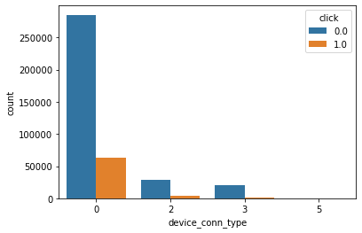
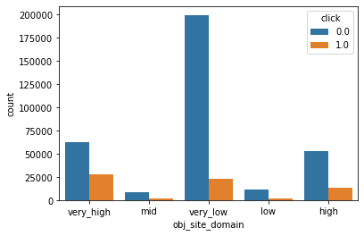
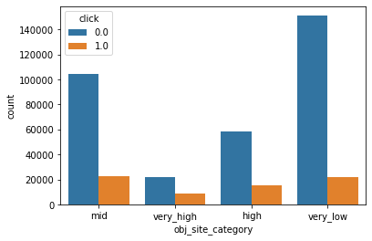
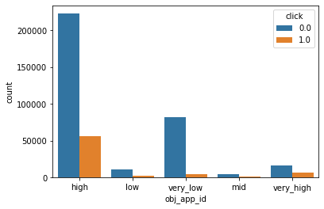
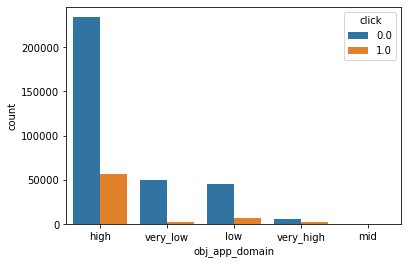

## 匯入所需資料與工具

### 匯入所需工具包


```python
import pandas as pd
import numpy as np
import matplotlib.pyplot as plt
import random
import gzip
import seaborn as sns
from scipy.stats import chi2_contingency
```

### 匯入資料並做初步檢查

#### 看train data跟test data長度


```python
train=pd.read_csv('/Users/hsuehchin/Desktop/avazu-ctr-prediction/train.gz')
test=pd.read_csv('/Users/hsuehchin/Desktop/avazu-ctr-prediction/test.gz')
print(len(train))
print(len(test))
```

#### 看train data跟test data有無null值


```python
print(train.isnull().any().sum())
print(test.isnull().any().sum())
```

#### train data資料太多，用每一百萬筆抽樣5%的方式取樣


```python
chunksize = 1000000
num_of_chunk = 0
train = pd.DataFrame()
    
for chunk in pd.read_csv('/Users/hsuehchin/Desktop/avazu-ctr-prediction/train.gz', chunksize=chunksize):
    num_of_chunk += 1
    train = pd.concat([train, chunk.sample(frac=.05, replace=False, random_state=123)], axis=0)
  
```

```python
print(len(train))
```

    2021448


## 資料預處理

#### 合併train+test一起處理


```python
train_test = pd.concat([train, test]).drop(['id'], axis=1)
```

#### 看一下欄位格式與有多少欄位


```python
train_test.info()
```

#### 把“hour”轉換成時間格式


```python
def to_date_column(df):
    df["dt_hour"] = pd.to_datetime(df["hour"], format="%y%m%d%H")
    df["year"] = df["dt_hour"].dt.year
    df["month"] = df["dt_hour"].dt.month
    df["day"] = df["dt_hour"].dt.day
    df["int_hour"] = df["dt_hour"].dt.hour
    df["is_weekday"] = df["dt_hour"].dt.dayofweek
    df["is_weekend"] = df.apply(lambda x: x["is_weekday"] in [5, 6], axis=1)
to_date_column(train_test)
train_test.head(5)
```

<table border="1" class="dataframe">
  <thead>
    <tr style="text-align: right;">
      <th></th>
      <th>click</th>
      <th>hour</th>
      <th>C1</th>
      <th>banner_pos</th>
      <th>site_id</th>
      <th>site_domain</th>
      <th>site_category</th>
      <th>app_id</th>
      <th>app_domain</th>
      <th>app_category</th>
      <th>...</th>
      <th>C19</th>
      <th>C20</th>
      <th>C21</th>
      <th>dt_hour</th>
      <th>year</th>
      <th>month</th>
      <th>day</th>
      <th>int_hour</th>
      <th>is_weekday</th>
      <th>is_weekend</th>
    </tr>
  </thead>
  <tbody>
    <tr>
      <th>373315</th>
      <td>1.0</td>
      <td>14102102</td>
      <td>1005</td>
      <td>1</td>
      <td>d9750ee7</td>
      <td>98572c79</td>
      <td>f028772b</td>
      <td>ecad2386</td>
      <td>7801e8d9</td>
      <td>07d7df22</td>
      <td>...</td>
      <td>1063</td>
      <td>-1</td>
      <td>33</td>
      <td>2014-10-21 02:00:00</td>
      <td>2014</td>
      <td>10</td>
      <td>21</td>
      <td>2</td>
      <td>1</td>
      <td>False</td>
    </tr>
    <tr>
      <th>459286</th>
      <td>0.0</td>
      <td>14102102</td>
      <td>1005</td>
      <td>0</td>
      <td>1fbe01fe</td>
      <td>f3845767</td>
      <td>28905ebd</td>
      <td>ecad2386</td>
      <td>7801e8d9</td>
      <td>07d7df22</td>
      <td>...</td>
      <td>35</td>
      <td>100083</td>
      <td>79</td>
      <td>2014-10-21 02:00:00</td>
      <td>2014</td>
      <td>10</td>
      <td>21</td>
      <td>2</td>
      <td>1</td>
      <td>False</td>
    </tr>
    <tr>
      <th>262398</th>
      <td>0.0</td>
      <td>14102102</td>
      <td>1005</td>
      <td>0</td>
      <td>1fbe01fe</td>
      <td>f3845767</td>
      <td>28905ebd</td>
      <td>ecad2386</td>
      <td>7801e8d9</td>
      <td>07d7df22</td>
      <td>...</td>
      <td>35</td>
      <td>100083</td>
      <td>79</td>
      <td>2014-10-21 02:00:00</td>
      <td>2014</td>
      <td>10</td>
      <td>21</td>
      <td>2</td>
      <td>1</td>
      <td>False</td>
    </tr>
    <tr>
      <th>789396</th>
      <td>0.0</td>
      <td>14102104</td>
      <td>1005</td>
      <td>1</td>
      <td>b8eae5f9</td>
      <td>1e334bd3</td>
      <td>f028772b</td>
      <td>ecad2386</td>
      <td>7801e8d9</td>
      <td>07d7df22</td>
      <td>...</td>
      <td>167</td>
      <td>100077</td>
      <td>23</td>
      <td>2014-10-21 04:00:00</td>
      <td>2014</td>
      <td>10</td>
      <td>21</td>
      <td>4</td>
      <td>1</td>
      <td>False</td>
    </tr>
    <tr>
      <th>383229</th>
      <td>0.0</td>
      <td>14102102</td>
      <td>1005</td>
      <td>0</td>
      <td>1fbe01fe</td>
      <td>f3845767</td>
      <td>28905ebd</td>
      <td>ecad2386</td>
      <td>7801e8d9</td>
      <td>07d7df22</td>
      <td>...</td>
      <td>35</td>
      <td>-1</td>
      <td>79</td>
      <td>2014-10-21 02:00:00</td>
      <td>2014</td>
      <td>10</td>
      <td>21</td>
      <td>2</td>
      <td>1</td>
      <td>False</td>
    </tr>
  </tbody>
</table>
<p>5 rows × 30 columns</p>

</div>

#### 檢查train data裡的device ip, device id不同日期重複率


```python
train_date=train
```


```python
def to_date_column(df):
    df["dt_hour"] = pd.to_datetime(df["hour"], format="%y%m%d%H")
    df["day"] = df["dt_hour"].dt.day
to_date_column(train_date)
```

##### device_id重複率


```python
mask=np.array(train.groupby('device_id').day.nunique())
len(mask[mask>1])/train.device_id.nunique()
```


    0.058530683910753285

##### device_ip重複率


```python
mask2=np.array(train.groupby('device_ip').day.nunique())
len(mask2[mask2>1])/train.device_ip.nunique()
```


    0.12682389648527118

### 刪掉不用的欄位

##### 1. device ip, device id不同日期重複率低，所以前十天的資料對預測第十一天的資料幫助應該不大，刪掉

##### 2. 題目為用10天的點擊狀況訓練模型，用以預測地11天的狀況，因此年月日期無意義，刪掉，小時跟星期幾商業上有意義，故保留


```python
train_test.drop(['hour','year','month','day','dt_hour', 'device_id', 'device_ip'], axis=1, inplace=True)
```

### 由題目說明可知欄位都是類別變數，把欄位格式錯的改正


```python
train_test.info()
```

    <class 'pandas.core.frame.DataFrame'>
    Int64Index: 6598912 entries, 373315 to 4577463
    Data columns (total 23 columns):
     #   Column            Dtype  
    ---  ------            -----  
     0   click             float64
     1   C1                int64  
     2   banner_pos        int64  
     3   site_id           object 
     4   site_domain       object 
     5   site_category     object 
     6   app_id            object 
     7   app_domain        object 
     8   app_category      object 
     9   device_model      object 
     10  device_type       int64  
     11  device_conn_type  int64  
     12  C14               int64  
     13  C15               int64  
     14  C16               int64  
     15  C17               int64  
     16  C18               int64  
     17  C19               int64  
     18  C20               int64  
     19  C21               int64  
     20  int_hour          int64  
     21  is_weekday        int64  
     22  is_weekend        bool   
    dtypes: bool(1), float64(1), int64(14), object(7)
    memory usage: 1.1+ GB

```python
need_tran_feature = train_test.columns[1:3].tolist() + train_test.columns[10:23].tolist()
for i in need_tran_feature:
    train_test[i] = train_test[i].astype(str)
```


### 因為都是類別變數，故用卡方檢定確定剩下的欄位與click是否相關


```python
categorical_columns= train_test.columns[1:23].tolist()
categorical_columns

chi2_check = []
for i in categorical_columns:
    if chi2_contingency(pd.crosstab(train_test['click'], train_test[i]))[1] < 0.05:
        chi2_check.append('Reject Null Hypothesis')
    else:
        chi2_check.append('Fail to Reject Null Hypothesis')
res = pd.DataFrame(data = [categorical_columns, chi2_check] 
             ).T 
res.columns = ['Column', 'Hypothesis']
print(res)
```

                  Column              Hypothesis
    0                 C1  Reject Null Hypothesis
    1         banner_pos  Reject Null Hypothesis
    2            site_id  Reject Null Hypothesis
    3        site_domain  Reject Null Hypothesis
    4      site_category  Reject Null Hypothesis
    5             app_id  Reject Null Hypothesis
    6         app_domain  Reject Null Hypothesis
    7       app_category  Reject Null Hypothesis
    8       device_model  Reject Null Hypothesis
    9        device_type  Reject Null Hypothesis
    10  device_conn_type  Reject Null Hypothesis
    11               C14  Reject Null Hypothesis
    12               C15  Reject Null Hypothesis
    13               C16  Reject Null Hypothesis
    14               C17  Reject Null Hypothesis
    15               C18  Reject Null Hypothesis
    16               C19  Reject Null Hypothesis
    17               C20  Reject Null Hypothesis
    18               C21  Reject Null Hypothesis
    19          int_hour  Reject Null Hypothesis
    20        is_weekday  Reject Null Hypothesis
    21        is_weekend  Reject Null Hypothesis


##### 每個欄位都拒絕虛無假說，故都保留

### 將value>10的欄位進行分類，做維度縮減

#### 找出value>10的欄位


```python
len_of_feature_count = []
for i in train_test.columns[1:23].tolist():
    print(i, ':', len(train_test[i].astype(str).value_counts()))
    len_of_feature_count.append(len(train_test[i].astype(str).value_counts()))
```

    C1 : 7
    banner_pos : 7
    site_id : 3126
    site_domain : 3699
    site_category : 23
    app_id : 4552
    app_domain : 250
    app_category : 29
    device_model : 5744
    device_type : 4
    device_conn_type : 4
    C14 : 2450
    C15 : 8
    C16 : 9
    C17 : 466
    C18 : 4
    C19 : 68
    C20 : 167
    C21 : 62
    int_hour : 24
    is_weekday : 7
    is_weekend : 2

```python
obj_features = []
for i in range(len(len_of_feature_count)):
    if len_of_feature_count[i] > 10:
        obj_features.append(train_test.columns[1:23].tolist()[i])
obj_features
```

#### 將各value依照平均CTR做分組，由高到低分五組

##### 看一下total點擊率
```
train_test_describe =train_test.describe()
print(round(train_test_describe,3))
```

##### 定義分組方法


```python
def gender_to_numeric(x):
    if x>=(0.17+0.04):
        return "very_high"
    if x>=(0.17+0.02):
        return "high"
    if x<=(0.17-0.04):
        return "very_low"
    if x<=(0.17-0.02):
        return "low"
    else: 
        return "mid"
```

##### 依序轉換每個value並把原本的欄位用新欄位取代


```python
temp=train_test
for i in obj_features:  
  y='obj_'+i
  x=train_test.groupby(train_test[i]).click.mean()
  z = pd.DataFrame({y:x})
  w=z[y].apply(gender_to_numeric)
  ww=pd.DataFrame(w)
  temp=pd.merge(temp,ww,on=i)
  temp.drop(i, axis=1, inplace=True
  )
```

```python
temp
```

<div>
<style scoped>
    .dataframe tbody tr th:only-of-type {
        vertical-align: middle;
    }

<table border="1" class="dataframe">
  <thead>
    <tr style="text-align: right;">
      <th></th>
      <th>click</th>
      <th>C1</th>
      <th>banner_pos</th>
      <th>device_type</th>
      <th>device_conn_type</th>
      <th>C15</th>
      <th>C16</th>
      <th>C18</th>
      <th>is_weekday</th>
      <th>is_weekend</th>
      <th>...</th>
      <th>obj_app_id</th>
      <th>obj_app_domain</th>
      <th>obj_app_category</th>
      <th>obj_device_model</th>
      <th>obj_C14</th>
      <th>obj_C17</th>
      <th>obj_C19</th>
      <th>obj_C20</th>
      <th>obj_C21</th>
      <th>obj_int_hour</th>
    </tr>
  </thead>
  <tbody>
    <tr>
      <th>0</th>
      <td>1.0</td>
      <td>1005</td>
      <td>1</td>
      <td>1</td>
      <td>0</td>
      <td>320</td>
      <td>50</td>
      <td>2</td>
      <td>1</td>
      <td>False</td>
      <td>...</td>
      <td>high</td>
      <td>high</td>
      <td>high</td>
      <td>high</td>
      <td>very_high</td>
      <td>very_high</td>
      <td>very_high</td>
      <td>high</td>
      <td>very_high</td>
      <td>mid</td>
    </tr>
    <tr>
      <th>1</th>
      <td>0.0</td>
      <td>1005</td>
      <td>1</td>
      <td>1</td>
      <td>0</td>
      <td>320</td>
      <td>50</td>
      <td>2</td>
      <td>1</td>
      <td>False</td>
      <td>...</td>
      <td>high</td>
      <td>high</td>
      <td>high</td>
      <td>high</td>
      <td>very_high</td>
      <td>very_high</td>
      <td>very_high</td>
      <td>high</td>
      <td>very_high</td>
      <td>mid</td>
    </tr>
    <tr>
      <th>2</th>
      <td>1.0</td>
      <td>1005</td>
      <td>1</td>
      <td>1</td>
      <td>0</td>
      <td>320</td>
      <td>50</td>
      <td>2</td>
      <td>1</td>
      <td>False</td>
      <td>...</td>
      <td>high</td>
      <td>high</td>
      <td>high</td>
      <td>high</td>
      <td>very_high</td>
      <td>very_high</td>
      <td>very_high</td>
      <td>high</td>
      <td>very_high</td>
      <td>mid</td>
    </tr>
    <tr>
      <th>3</th>
      <td>0.0</td>
      <td>1005</td>
      <td>1</td>
      <td>1</td>
      <td>0</td>
      <td>320</td>
      <td>50</td>
      <td>2</td>
      <td>1</td>
      <td>False</td>
      <td>...</td>
      <td>high</td>
      <td>high</td>
      <td>high</td>
      <td>high</td>
      <td>very_high</td>
      <td>very_high</td>
      <td>very_high</td>
      <td>high</td>
      <td>very_high</td>
      <td>mid</td>
    </tr>
    <tr>
      <th>4</th>
      <td>0.0</td>
      <td>1005</td>
      <td>1</td>
      <td>1</td>
      <td>0</td>
      <td>320</td>
      <td>50</td>
      <td>2</td>
      <td>2</td>
      <td>False</td>
      <td>...</td>
      <td>high</td>
      <td>high</td>
      <td>high</td>
      <td>high</td>
      <td>very_high</td>
      <td>very_high</td>
      <td>very_high</td>
      <td>high</td>
      <td>very_high</td>
      <td>mid</td>
    </tr>
    <tr>
      <th>...</th>
      <td>...</td>
      <td>...</td>
      <td>...</td>
      <td>...</td>
      <td>...</td>
      <td>...</td>
      <td>...</td>
      <td>...</td>
      <td>...</td>
      <td>...</td>
      <td>...</td>
      <td>...</td>
      <td>...</td>
      <td>...</td>
      <td>...</td>
      <td>...</td>
      <td>...</td>
      <td>...</td>
      <td>...</td>
      <td>...</td>
      <td>...</td>
    </tr>
    <tr>
      <th>6598907</th>
      <td>NaN</td>
      <td>1012</td>
      <td>0</td>
      <td>1</td>
      <td>0</td>
      <td>320</td>
      <td>50</td>
      <td>3</td>
      <td>4</td>
      <td>False</td>
      <td>...</td>
      <td>high</td>
      <td>high</td>
      <td>high</td>
      <td>very_high</td>
      <td>very_low</td>
      <td>very_low</td>
      <td>very_low</td>
      <td>very_low</td>
      <td>very_high</td>
      <td>mid</td>
    </tr>
    <tr>
      <th>6598908</th>
      <td>NaN</td>
      <td>1012</td>
      <td>0</td>
      <td>1</td>
      <td>0</td>
      <td>320</td>
      <td>50</td>
      <td>3</td>
      <td>4</td>
      <td>False</td>
      <td>...</td>
      <td>high</td>
      <td>high</td>
      <td>high</td>
      <td>very_high</td>
      <td>very_low</td>
      <td>very_low</td>
      <td>very_low</td>
      <td>very_low</td>
      <td>very_high</td>
      <td>mid</td>
    </tr>
    <tr>
      <th>6598909</th>
      <td>0.0</td>
      <td>1002</td>
      <td>0</td>
      <td>0</td>
      <td>0</td>
      <td>320</td>
      <td>50</td>
      <td>3</td>
      <td>5</td>
      <td>True</td>
      <td>...</td>
      <td>high</td>
      <td>high</td>
      <td>high</td>
      <td>low</td>
      <td>very_low</td>
      <td>very_low</td>
      <td>very_low</td>
      <td>very_low</td>
      <td>very_high</td>
      <td>mid</td>
    </tr>
    <tr>
      <th>6598910</th>
      <td>1.0</td>
      <td>1005</td>
      <td>0</td>
      <td>1</td>
      <td>0</td>
      <td>300</td>
      <td>250</td>
      <td>0</td>
      <td>1</td>
      <td>False</td>
      <td>...</td>
      <td>high</td>
      <td>high</td>
      <td>high</td>
      <td>very_high</td>
      <td>very_low</td>
      <td>very_low</td>
      <td>very_low</td>
      <td>very_low</td>
      <td>very_low</td>
      <td>mid</td>
    </tr>
    <tr>
      <th>6598911</th>
      <td>0.0</td>
      <td>1005</td>
      <td>0</td>
      <td>1</td>
      <td>0</td>
      <td>300</td>
      <td>250</td>
      <td>0</td>
      <td>1</td>
      <td>False</td>
      <td>...</td>
      <td>very_high</td>
      <td>low</td>
      <td>very_low</td>
      <td>high</td>
      <td>very_low</td>
      <td>very_low</td>
      <td>very_low</td>
      <td>very_low</td>
      <td>very_low</td>
      <td>mid</td>
    </tr>
  </tbody>
</table>
<p>6598912 rows × 23 columns</p>
</div>

##### 看一下分組後的結果


```python
for i in temp.columns:
    sns.countplot(x = i, hue = "click", data = temp)
    plt.show()
```

















##### obj_int_hour僅有"mid"一種值，對預測沒意義，故刪掉


```python
temp.drop(['obj_int_hour'], axis=1, inplace=True)
```


## one hot encoding 


```python
temp_one_hot = pd.get_dummies(temp)
```


## 分割train, test後輸出，避免之後每次都要重跑


```python
#分割test
test_one_hot=temp_one_hot['click'].isnull()
temp_one_hot[test_one_hot]
new_test=temp_one_hot[test_one_hot]
new_test.to_csv('test_final_0808', index=False)
```


```python
#分割train
train_one_hot=temp_one_hot['click'].notnull()
temp_one_hot[train_one_hot]
new_train=temp_one_hot[train_one_hot]
new_train.to_csv('train_final_0808', index=False)
```


```python

```

由於電腦效能問題，建模與調整超參數轉到google colab進行

## 匯入建模與調整超參數所需套件與資料


```python
import pandas as pd
import numpy as np
import matplotlib.pyplot as plt
import random
import gzip
import seaborn as sns
from sklearn.model_selection import GridSearchCV
from sklearn.metrics import roc_auc_score
from xgboost import XGBClassifier
from sklearn.metrics import confusion_matrix
from sklearn.model_selection import train_test_split
from sklearn.metrics import precision_score
from sklearn.metrics import accuracy_score
```

#### 由於檔案存在google雲端硬碟，呼叫google相關套件


```python
# mount Google Drive
from google.colab import drive
drive.mount('/content/drive')
```

    Mounted at /content/drive

```python
%cd /content/drive/Shareddrives/CS_ml/final
```

    /content/drive/Shareddrives/CS_ml/final


#### 存取已經處理好的train跟test data


```python
train= pd.read_csv('train_final_0807.csv') 
```


```python
test= pd.read_csv('test_final.csv')
```


## 調整超參數

##### 本次使用XGBClassifier進行訓練，訓練前使用GridSearchCV調參

### 正反標籤比例失衡，為求模型準確，從train資料集中抽取跟成正反標籤佔筆各佔50％的資料集


```python
pre_X = train[train['click'] == 0].sample(n=len(train[train['click'] == 1]), random_state=123)
pre_X = pd.concat([pre_X, train[train['click'] == 1]]).sample(frac=1)
pre_y = pre_X[['click']]
pre_X.drop(['click'], axis=1, inplace=True)
```


### 將資料集分割為訓練集與驗證集


```python
pre_X_train, pre_X_test, pre_y_train, pre_y_test = train_test_split(pre_X, pre_y, test_size=0.20, stratify=pre_y, random_state=1)
```


### 用GridSearchCV自動調參，並讓嘗試不同的參數組合，最後以最高分的組合來建模

##### 用roc_aoc來衡量，因為aoc反應的是分類器對樣本的排序能力，且比較適合樣本不平均的資料集，預測CTR常常是為了找出比較有可能被點擊的廣告，即是考驗模型的排序能力，且點擊與否常常樣本不平均


#### 先嘗試max_depth跟min_child_weight的組合


```python
param_test1 = {'max_depth': [1,10,3] ,'min_child_weight':[1,5,2]}

gsearch = GridSearchCV(estimator = XGBClassifier(learning_rate =0.1,n_estimators=300, max_depth=5,
                                                                                                              min_child_weight=1,gamma=0,subsample=1,objective= 'binary:logistic',seed=27),param_grid = param_test1,verbose=1,scoring='roc_auc', n_jobs=-1,cv=5)gsearch.fit(pre_X_train, pre_y_train)gsearch.best_score_, gsearch.best_params_print('max_depth_min_child_weight')print('gsearch1.best_params_', gsearch.best_params_)print('gsearch1.best_score_', gsearch.best_score_)
```

    Fitting 5 folds for each of 9 candidates, totalling 45 fits


    [Parallel(n_jobs=-1)]: Using backend LokyBackend with 4 concurrent workers.[Parallel(n_jobs=-1)]: Done  45 out of  45 | elapsed: 134.5min finished/usr/local/lib/python3.7/dist-packages/sklearn/preprocessing/_label.py:235: DataConversionWarning: A column-vector y was passed when a 1d array was expected. Please change the shape of y to (n_samples, ), for example using ravel().  y = column_or_1d(y, warn=True)/usr/local/lib/python3.7/dist-packages/sklearn/preprocessing/_label.py:268: DataConversionWarning: A column-vector y was passed when a 1d array was expected. Please change the shape of y to (n_samples, ), for example using ravel().  y = column_or_1d(y, warn=True)


    max_depth_min_child_weightgsearch1.best_params_ {'max_depth': 10, 'min_child_weight': 5}gsearch1.best_score_ 0.6619254082294317

#### 帶入上面程式選出的最佳max_depth跟min_child_weight後，嘗試不同的gamma


```python
param_test2 = {'gamma':[i/10.0 for i in range(0,3)]}
gsearch = GridSearchCV(estimator = XGBClassifier(learning_rate =0.1,n_estimators=300,max_depth=10,min_child_weight=5,gamma=0,subsample=1,objective= 'binary:logistic',seed=27),param_grid = param_test2,verbose=1,scoring='roc_auc',n_jobs=-1,cv=5)
gsearch.fit(pre_X_train, pre_y_train)gsearch.best_score_, gsearch.best_params_print('gamma')print('gsearch1.best_params_', gsearch.best_params_)print('gsearch1.best_score_', gsearch.best_score_)
```

    Fitting 5 folds for each of 3 candidates, totalling 15 fits


    [Parallel(n_jobs=-1)]: Using backend LokyBackend with 4 concurrent workers./usr/local/lib/python3.7/dist-packages/joblib/externals/loky/process_executor.py:691: UserWarning: A worker stopped while some jobs were given to the executor. This can be caused by a too short worker timeout or by a memory leak.  "timeout or by a memory leak.", UserWarning[Parallel(n_jobs=-1)]: Done  15 out of  15 | elapsed: 103.1min finished/usr/local/lib/python3.7/dist-packages/sklearn/preprocessing/_label.py:235: DataConversionWarning: A column-vector y was passed when a 1d array was expected. Please change the shape of y to (n_samples, ), for example using ravel().  y = column_or_1d(y, warn=True)/usr/local/lib/python3.7/dist-packages/sklearn/preprocessing/_label.py:268: DataConversionWarning: A column-vector y was passed when a 1d array was expected. Please change the shape of y to (n_samples, ), for example using ravel().  y = column_or_1d(y, warn=True)


    gammagsearch1.best_params_ {'gamma': 0.2}gsearch1.best_score_ 0.6625018173495085


### 依據Grid Search的結果建立一個模型，並fit資料


```python
outcome1 = gsearch.best_estimator_
outcome1.fit(pre_X,pre_y)
```

    /usr/local/lib/python3.7/dist-packages/sklearn/preprocessing/_label.py:235: DataConversionWarning: A column-vector y was passed when a 1d array was expected. Please change the shape of y to (n_samples, ), for example using ravel().
      y = column_or_1d(y, warn=True)
    /usr/local/lib/python3.7/dist-packages/sklearn/preprocessing/_label.py:268: DataConversionWarning: A column-vector y was passed when a 1d array was expected. Please change the shape of y to (n_samples, ), for example using ravel().
      y = column_or_1d(y, warn=True)
    
    XGBClassifier(base_score=0.5, booster='gbtree', colsample_bylevel=1,
                  colsample_bynode=1, colsample_bytree=1, gamma=0.2,
                  learning_rate=0.1, max_delta_step=0, max_depth=10,
                  min_child_weight=5, missing=None, n_estimators=300, n_jobs=1,
                  nthread=None, objective='binary:logistic', random_state=0,
                  reg_alpha=0, reg_lambda=1, scale_pos_weight=1, seed=27,
                  silent=None, subsample=1, verbosity=1)

### 輸出重要特徵，並依特徵之重要性排序


```python
feature_importances = pd.DataFrame(outcome1.feature_importances_)
feature_importances.index = pre_X_train.columns
feature_importances = feature_importances.sort_values(0,ascending=False)
feature_importances.round(5)
```


<div>
<style scoped>
    .dataframe tbody tr th:only-of-type {
        vertical-align: middle;
    }
</style>


<table border="1" class="dataframe">
  <thead>
    <tr style="text-align: right;">
      <th></th>
      <th>0</th>
    </tr>
  </thead>
  <tbody>
    <tr>
      <th>obj_site_id_very_low</th>
      <td>0.18133</td>
    </tr>
    <tr>
      <th>obj_C14_very_low</th>
      <td>0.16863</td>
    </tr>
    <tr>
      <th>obj_app_id_very_high</th>
      <td>0.12546</td>
    </tr>
    <tr>
      <th>obj_site_id_very_high</th>
      <td>0.11235</td>
    </tr>
    <tr>
      <th>obj_app_id_very_low</th>
      <td>0.07209</td>
    </tr>
    <tr>
      <th>obj_app_category_high</th>
      <td>0.05985</td>
    </tr>
    <tr>
      <th>C16_250</th>
      <td>0.04858</td>
    </tr>
    <tr>
      <th>C18_1</th>
      <td>0.01301</td>
    </tr>
    <tr>
      <th>obj_site_domain_very_low</th>
      <td>0.01165</td>
    </tr>
    <tr>
      <th>obj_site_category_high</th>
      <td>0.01110</td>
    </tr>
    <tr>
      <th>obj_C21_very_low</th>
      <td>0.00542</td>
    </tr>
    <tr>
      <th>obj_device_model_low</th>
      <td>0.00503</td>
    </tr>
    <tr>
      <th>C1_1005</th>
      <td>0.00483</td>
    </tr>
    <tr>
      <th>obj_device_model_very_high</th>
      <td>0.00476</td>
    </tr>
    <tr>
      <th>C15_216</th>
      <td>0.00437</td>
    </tr>
    <tr>
      <th>C16_50</th>
      <td>0.00434</td>
    </tr>
    <tr>
      <th>banner_pos_1</th>
      <td>0.00420</td>
    </tr>
    <tr>
      <th>obj_C21_high</th>
      <td>0.00409</td>
    </tr>
    <tr>
      <th>banner_pos_0</th>
      <td>0.00394</td>
    </tr>
    <tr>
      <th>obj_app_domain_high</th>
      <td>0.00362</td>
    </tr>
    <tr>
      <th>obj_app_id_low</th>
      <td>0.00351</td>
    </tr>
    <tr>
      <th>obj_device_model_very_low</th>
      <td>0.00338</td>
    </tr>
    <tr>
      <th>device_conn_type_0</th>
      <td>0.00335</td>
    </tr>
    <tr>
      <th>obj_C21_low</th>
      <td>0.00335</td>
    </tr>
    <tr>
      <th>obj_app_domain_very_high</th>
      <td>0.00332</td>
    </tr>
    <tr>
      <th>obj_app_domain_mid</th>
      <td>0.00317</td>
    </tr>
    <tr>
      <th>obj_site_category_very_low</th>
      <td>0.00317</td>
    </tr>
    <tr>
      <th>obj_app_domain_very_low</th>
      <td>0.00306</td>
    </tr>
    <tr>
      <th>obj_site_domain_low</th>
      <td>0.00303</td>
    </tr>
    <tr>
      <th>obj_site_domain_very_high</th>
      <td>0.00296</td>
    </tr>
    <tr>
      <th>C18_0</th>
      <td>0.00295</td>
    </tr>
    <tr>
      <th>obj_C17_high</th>
      <td>0.00283</td>
    </tr>
    <tr>
      <th>C1_1012</th>
      <td>0.00278</td>
    </tr>
    <tr>
      <th>obj_C21_mid</th>
      <td>0.00274</td>
    </tr>
    <tr>
      <th>obj_C14_very_high</th>
      <td>0.00273</td>
    </tr>
    <tr>
      <th>obj_C20_very_low</th>
      <td>0.00271</td>
    </tr>
    <tr>
      <th>C15_300</th>
      <td>0.00270</td>
    </tr>
    <tr>
      <th>obj_site_category_mid</th>
      <td>0.00268</td>
    </tr>
    <tr>
      <th>obj_C20_very_high</th>
      <td>0.00267</td>
    </tr>
    <tr>
      <th>obj_site_id_high</th>
      <td>0.00263</td>
    </tr>
    <tr>
      <th>C18_3</th>
      <td>0.00262</td>
    </tr>
    <tr>
      <th>obj_C21_very_high</th>
      <td>0.00257</td>
    </tr>
    <tr>
      <th>obj_C14_low</th>
      <td>0.00254</td>
    </tr>
    <tr>
      <th>C15_320</th>
      <td>0.00250</td>
    </tr>
    <tr>
      <th>C1_1002</th>
      <td>0.00239</td>
    </tr>
    <tr>
      <th>obj_app_category_very_high</th>
      <td>0.00235</td>
    </tr>
    <tr>
      <th>obj_C17_low</th>
      <td>0.00234</td>
    </tr>
    <tr>
      <th>C18_2</th>
      <td>0.00231</td>
    </tr>
    <tr>
      <th>C16_480</th>
      <td>0.00230</td>
    </tr>
    <tr>
      <th>obj_app_domain_low</th>
      <td>0.00226</td>
    </tr>
    <tr>
      <th>obj_C17_very_low</th>
      <td>0.00223</td>
    </tr>
    <tr>
      <th>obj_C19_very_low</th>
      <td>0.00219</td>
    </tr>
    <tr>
      <th>obj_site_category_very_high</th>
      <td>0.00217</td>
    </tr>
    <tr>
      <th>obj_C20_mid</th>
      <td>0.00213</td>
    </tr>
    <tr>
      <th>obj_app_id_mid</th>
      <td>0.00210</td>
    </tr>
    <tr>
      <th>obj_app_id_high</th>
      <td>0.00207</td>
    </tr>
    <tr>
      <th>obj_C19_very_high</th>
      <td>0.00202</td>
    </tr>
    <tr>
      <th>obj_C17_mid</th>
      <td>0.00200</td>
    </tr>
    <tr>
      <th>obj_app_category_very_low</th>
      <td>0.00196</td>
    </tr>
    <tr>
      <th>obj_site_id_low</th>
      <td>0.00186</td>
    </tr>
    <tr>
      <th>obj_C19_low</th>
      <td>0.00182</td>
    </tr>
    <tr>
      <th>device_type_1</th>
      <td>0.00179</td>
    </tr>
    <tr>
      <th>obj_C19_mid</th>
      <td>0.00178</td>
    </tr>
    <tr>
      <th>obj_C14_mid</th>
      <td>0.00172</td>
    </tr>
    <tr>
      <th>is_weekend_False</th>
      <td>0.00171</td>
    </tr>
    <tr>
      <th>obj_C17_very_high</th>
      <td>0.00169</td>
    </tr>
    <tr>
      <th>obj_site_domain_mid</th>
      <td>0.00167</td>
    </tr>
    <tr>
      <th>obj_C14_high</th>
      <td>0.00163</td>
    </tr>
    <tr>
      <th>obj_C20_low</th>
      <td>0.00156</td>
    </tr>
    <tr>
      <th>is_weekday_6</th>
      <td>0.00154</td>
    </tr>
    <tr>
      <th>obj_site_domain_high</th>
      <td>0.00152</td>
    </tr>
    <tr>
      <th>device_conn_type_3</th>
      <td>0.00151</td>
    </tr>
    <tr>
      <th>obj_app_category_low</th>
      <td>0.00149</td>
    </tr>
    <tr>
      <th>is_weekday_1</th>
      <td>0.00147</td>
    </tr>
    <tr>
      <th>is_weekday_3</th>
      <td>0.00146</td>
    </tr>
    <tr>
      <th>is_weekday_4</th>
      <td>0.00145</td>
    </tr>
    <tr>
      <th>C1_1010</th>
      <td>0.00144</td>
    </tr>
    <tr>
      <th>obj_device_model_high</th>
      <td>0.00140</td>
    </tr>
    <tr>
      <th>is_weekday_2</th>
      <td>0.00140</td>
    </tr>
    <tr>
      <th>obj_C20_high</th>
      <td>0.00139</td>
    </tr>
    <tr>
      <th>is_weekday_5</th>
      <td>0.00138</td>
    </tr>
    <tr>
      <th>is_weekday_0</th>
      <td>0.00135</td>
    </tr>
    <tr>
      <th>device_conn_type_2</th>
      <td>0.00135</td>
    </tr>
    <tr>
      <th>obj_site_id_mid</th>
      <td>0.00127</td>
    </tr>
    <tr>
      <th>obj_device_model_mid</th>
      <td>0.00107</td>
    </tr>
    <tr>
      <th>device_type_4</th>
      <td>0.00101</td>
    </tr>
    <tr>
      <th>obj_site_category_low</th>
      <td>0.00099</td>
    </tr>
    <tr>
      <th>device_type_5</th>
      <td>0.00082</td>
    </tr>
    <tr>
      <th>device_conn_type_5</th>
      <td>0.00076</td>
    </tr>
    <tr>
      <th>C1_1008</th>
      <td>0.00075</td>
    </tr>
    <tr>
      <th>C1_1007</th>
      <td>0.00073</td>
    </tr>
    <tr>
      <th>banner_pos_2</th>
      <td>0.00072</td>
    </tr>
    <tr>
      <th>banner_pos_7</th>
      <td>0.00060</td>
    </tr>
    <tr>
      <th>C15_728</th>
      <td>0.00055</td>
    </tr>
    <tr>
      <th>banner_pos_4</th>
      <td>0.00052</td>
    </tr>
    <tr>
      <th>C15_1024</th>
      <td>0.00040</td>
    </tr>
    <tr>
      <th>C15_480</th>
      <td>0.00037</td>
    </tr>
    <tr>
      <th>C1_1001</th>
      <td>0.00032</td>
    </tr>
    <tr>
      <th>obj_app_category_mid</th>
      <td>0.00023</td>
    </tr>
    <tr>
      <th>obj_C19_high</th>
      <td>0.00016</td>
    </tr>
    <tr>
      <th>C16_90</th>
      <td>0.00000</td>
    </tr>
    <tr>
      <th>C16_768</th>
      <td>0.00000</td>
    </tr>
    <tr>
      <th>C16_36</th>
      <td>0.00000</td>
    </tr>
    <tr>
      <th>C16_320</th>
      <td>0.00000</td>
    </tr>
    <tr>
      <th>banner_pos_3</th>
      <td>0.00000</td>
    </tr>
    <tr>
      <th>banner_pos_5</th>
      <td>0.00000</td>
    </tr>
    <tr>
      <th>C16_1024</th>
      <td>0.00000</td>
    </tr>
    <tr>
      <th>C15_768</th>
      <td>0.00000</td>
    </tr>
    <tr>
      <th>C15_120</th>
      <td>0.00000</td>
    </tr>
    <tr>
      <th>is_weekend_True</th>
      <td>0.00000</td>
    </tr>
    <tr>
      <th>device_type_2</th>
      <td>0.00000</td>
    </tr>
    <tr>
      <th>device_type_0</th>
      <td>0.00000</td>
    </tr>
    <tr>
      <th>C16_20</th>
      <td>0.00000</td>
    </tr>
  </tbody>
</table>

</div>

#### 避免模型過擬合，最終預測模型之特徵，只將採用特徵值 0.01以上的變數

```python
feature_len = len(feature_importances[feature_importances[feature_importances.columns[0]] > 0.01])
```


### 調整最終完整Train Set 與 Test set之特徵


```python
y = train[['click']]
X = train[feature_importances[:feature_len].index]
test2 = test[feature_importances[:feature_len].index]
```


## 使用XGBClassifier建模


### 使用之前調參得到的節點做深度限制


```python
model = XGBClassifier( n_jobs=-1, n_estimators=300, tree_method = 'gpu_hist', max_depth=10, min_samples_split=5, gamma=0.2, subsample=1, alpha=0)
model.fit(X,y.values.ravel())
y_pred = model.predict(X)
```


### 查看結果

#### 輸出roc_auc_score與正確率

##### 原本有放device ip, device id這兩個欄位，roc_auc_score高達80%，且兩個欄位重要性都很高，但是過擬合很嚴重，考慮到可能是前十天有出現過的device id、device ip，在第十一天出現的比例過少，故直接拿掉，雖然roc_auc_score驟降，但是kaggle的分數從0.6提升0.5


```python
model.fit(X,y.values.ravel())
y_pred = model.predict(X)
print("accuracy_score: ",precision_score(y,y_pred)*100,"%")
print("Roc_auc_score: ",roc_auc_score(y,y_pred)*100,"%")
```

    accuracy_score:  83.30043612301677 %
    Roc_auc_score:  56.05388243153247 %


#### 輸出混淆矩陣


```python
confmat = confusion_matrix(y_true=y, y_pred=y_pred, labels=[0, 1])
fig, ax = plt.subplots(figsize=(2.5, 2.5))
ax.matshow(confmat,  alpha=0.3)
for i in range(confmat.shape[0]):
    for j in range(confmat.shape[1]):
        ax.text(x=j, y=i, s=confmat[i, j], va='center', ha='center')

plt.xlabel('Predicted label')
plt.ylabel('True label')

plt.tight_layout()
plt.show()

```


## 匯出submission並進行提交


```python
submission = pd.read_csv('sampleSubmission.csv',  index_col='id')
submission[submission.columns[0]] = model.predict_proba(test2)[:,1]
submission.to_csv('0809_0015_train2_not_con3.csv')
```

